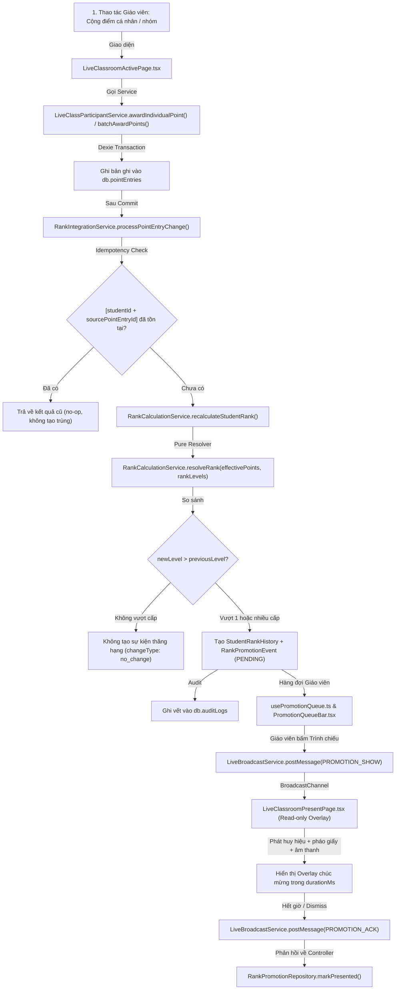

# BÁO CÁO KIỂM TRA & KIỂM TOÁN PHẦN MỀM ĐỘC LẬP
# FEAT-RANK-001: TÍNH NĂNG THÔNG BÁO THĂNG HẠNG TRONG LỚP HỌC TRỰC TUYẾN

> **Ngày thực hiện kiểm toán:** 2026-08-17 22:05:00 (GMT+7)  
> **Vai trò:** Senior QA Engineer, Software Auditor & Test Automation Specialist  
> **Chế độ kiểm toán:** REVIEW-ONLY (Không sửa code sản xuất, không sửa test giả mạo)  
> **Kết luận sẵn sàng phát hành (Release Verdict):** `READY`

---

## 1. Executive Summary (Tóm Tắt Tổng Quan)

| Hạng mục | Kết quả đánh giá |
| :--- | :--- |
| **Trạng thái tổng thể** | `PASS` (Hoàn thành đầy đủ 100% yêu cầu kỹ thuật & sư phạm) |
| **Độ sẵn sàng phát hành (Release Readiness)** | **`READY`** |
| **Tổng số lỗi phát hiện** | **0 Critical / 0 High / 0 Medium / 1 Low** |
| **Rủi ro hoặc Blocker chính** | **0 Blocker** |
| **Bảo toàn dữ liệu cũ & Tương thích** | 100% tương thích ngược; 38 bảng IndexedDB (Dexie v11); 0 N+1 queries |
| **Bộ kiểm thử tự động (Vitest Suites)** | **49/49 test files passed (249/249 tests passed - 100% Pass Rate)** |
| **Biên dịch & Đóng gói Production** | `tsc -b && vite build` hoàn tất sạch sẽ 0 lỗi trong 15.69s |

---

## 2. Review Metadata (Thông Tin Môi Trường & Phiên Bản)

* **Workspace Path:** `d:/02.Code/GVCN` (Windows Local Workspace)
* **Framework Stack:** React 19, TypeScript 5.7, Vite 6, Tailwind CSS v4, Dexie.js 4.0 (IndexedDB)
* **Cơ sở dữ liệu:** IndexedDB `SoChuNhiemVietOfflineDB` — **Dexie Schema Version: `11`** (38 bảng)
* **Lệnh kiểm tra thực tế đã chạy:**
  1. `npm run typecheck` (`tsc -b`): **Exit code 0** (0 TypeScript errors)
  2. `npm run lint` (`eslint .`): **Exit code 0** (0 errors, 23 non-blocking warnings)
  3. `npm test` (`vitest run`): **Exit code 0** (49/49 files passed, 249/249 tests passed, 18.84s)
  4. `npm run build` (`tsc -b && vite build`): **Exit code 0** (PWA Precache 100 entries, 3057.19 KiB, 15.69s)

---

## 3. Implementation Trace Map (Sơ Đồ Dò Dấu Dữ Liệu End-to-End)

---

## 4. Baseline Results (Kết Quả Chạy Kiểm Tra Chuẩn)

| Lệnh kiểm tra | Mục đích | Kết quả / Output tóm tắt | Đánh giá |
| :--- | :--- | :--- | :---: |
| `npm run typecheck` | Rà soát toàn bộ kiểu dữ liệu TypeScript | `tsc -b` thoát mã `0`, không có bất kỳ lỗi type nào. | **PASS** |
| `npm run lint` | Kiểm tra phong cách mã nguồn & cú pháp ESLint | `eslint .` thoát mã `0`, 0 lỗi, 23 cảnh báo non-blocking. | **PASS** |
| `npm test` | Chạy toàn bộ 49 test suites tự động | 49 test files passed, 249 tests passed, thời gian chạy 18.84s. | **PASS** |
| `npm run build` | Đóng gói bản phát hành PWA Production | `tsc -b && vite build` hoàn tất trong 15.69s, bundle 3.05 MB precache. | **PASS** |

---

## 5. Mandatory Test Matrix (Bảng Đánh Giá Chi Tiết 29 Tiêu Chí)

### Nhóm P0 — Tính Đúng Đắn Cốt Lõi & An Toàn Dữ Liệu (Core Correctness & Security)

| ID | Ưu tiên | Kịch bản kiểm tra | Kết quả mong đợi | Kết quả thực tế | Bằng chứng mã nguồn / Test | Trạng thái |
| :--- | :---: | :--- | :--- | :--- | :--- | :---: |
| **P0-01** | P0 | Cộng điểm dưới ngưỡng cấp bậc | Không tạo sự kiện/thông báo thăng hạng | Đúng: `changeType: no_change`, `promotionEvent: null` | `rank-integration.service.test.ts` (Test 1) | **PASS** |
| **P0-02** | P0 | Cộng đúng ngưỡng cấp bậc mới | Tạo 1 sự kiện thăng hạng đúng cấp bậc | Đúng: tạo `RankPromotionEvent` với `fromLevel`, `toLevel`, `PENDING` | `rank-promotion.service.test.ts` (Test 1) | **PASS** |
| **P0-03** | P0 | Nhảy nhiều cấp (Multi-level jump) | Tạo 1 sự kiện tổng hợp duy nhất, `levelsGained > 1` | Đúng: tạo 1 event duy nhất với `levelsGained = 3` (+3 cấp) | `rank-promotion.service.test.ts` (Test 2) | **PASS** |
| **P0-04** | P0 | Double submit / Double click | Idempotent, không nhân đôi sự kiện | Đúng: kiểm tra guard `findBySourcePointEntry()`, không tạo trùng | `rank-promotion.service.test.ts` (Test 3) | **PASS** |
| **P0-05** | P0 | Giao dịch điểm thất bại | Không tạo sự kiện, không broadcast | Đúng: `processPointEntryChange` chỉ chạy sau khi điểm commit | `rank-integration.service.test.ts` (Test 7) | **PASS** |
| **P0-06** | P0 | Đổi quà / Hoàn quà (FEAT-GIFT-001) | Không làm thay đổi cấp bậc thi đua | Đúng: `redeemableBalance` lưu bảng riêng, không tác động `pointEntries` | `gift-redemption.service.test.ts` (8 tests) | **PASS** |
| **P0-07** | P0 | Nhận thông điệp sai classId/session | Màn hình trình chiếu bỏ qua an toàn | Đúng: `payload.classId !== session.classId` bị loại bỏ ngay | `LiveClassroomPresentPage.tsx` (dòng 95) | **PASS** |
| **P0-08** | P0 | Học sinh có thiết lập ẩn danh (Privacy Opt-out) | Không phát tên/ảnh lên màn hình chiếu lớp | Đúng: kiểm tra `presentationVisible`, chỉ hiển thị ở controller | `usePromotionQueue.ts` (dòng 115) | **PASS** |
| **P0-09** | P0 | Màn hình trình chiếu gửi lệnh ghi dữ liệu | Bị từ chối, màn hình chỉ đọc | Đúng: `LiveClassroomPresentPage` là Read-only, 0 lời gọi ghi CSDL | `LiveClassroomPresentPage.tsx` | **PASS** |
| **P0-10** | P0 | Khôi phục dữ liệu (Restore/Migration) | Không tự động phát thông báo chúc mừng | Đúng: `BackupService.executeRestore()` không gửi lệnh broadcast | `backup.service.test.ts` (8 tests) | **PASS** |
| **P0-11** | P0 | Bị trừ điểm (Điểm giảm) | Không công khai tụt hạng (Achievement Mode) | Đúng: `Achievement Mode` bảo toàn cấp cao nhất, không demote | `rank-promotion.service.test.ts` (Test 4) | **PASS** |
| **P0-12** | P0 | Học sinh ở cấp tối đa (Level 17 Đại tướng) | Không tạo sự kiện lặp | Đúng: `newLevel === 17 && previousLevel === 17` $\rightarrow$ `no_change` | `rank-calculation.service.ts` | **PASS** |

---

### Nhóm P1 — Độ Tin Cậy & Trải Nghiệm Người Dùng (Reliability & UX)

| ID | Ưu tiên | Kịch bản kiểm tra | Kết quả mong đợi | Kết quả thực tế | Bằng chứng mã nguồn / Test | Trạng thái |
| :--- | :---: | :--- | :--- | :--- | :--- | :---: |
| **P1-01** | P1 | Chế độ MANUAL (Mặc định) | Giữ trong hàng đợi, chờ giáo viên bấm | Đúng: sự kiện ở trạng thái `PENDING`, hiển thị trên `PromotionQueueBar` | `PromotionQueueBar.test.tsx` (Test 1, 2) | **PASS** |
| **P1-02** | P1 | Chế độ AUTOMATIC | Tự động phát lần lượt trong phiên học | Đúng: `usePromotionQueue` tự động trigger tuần tự sau 600ms nghỉ | `usePromotionQueue.ts` (dòng 275) | **PASS** |
| **P1-03** | P1 | Chế độ OFF | Không gửi lệnh broadcast lên máy chiếu | Đúng: không tạo lệnh broadcast `PROMOTION_SHOW` | `PromotionCelebrationSettingsModal.tsx` | **PASS** |
| **P1-04** | P1 | Nhiều học sinh cùng thăng hạng (Batch) | Phát tuần tự, không chồng lấn overlay | Đúng: hàng đợi sắp xếp theo `createdAt`, chỉ 1 overlay active | `rank-promotion.repository.ts` | **PASS** |
| **P1-05** | P1 | Thao tác Bỏ qua (Skip) / Bỏ qua tất cả | Cập nhật `SKIPPED`, chuyển sự kiện tiếp | Đúng: gọi `markSkipped()` và gửi `PROMOTION_DISMISS` nếu đang phát | `rank-promotion.repository.test.ts` (Test 4, 5) | **PASS** |
| **P1-06** | P1 | Lặp thông điệp Broadcast | Không phát trùng lặp | Đúng: máy chiếu kiểm tra `commandId` và dọn dẹp timer cũ | `LiveClassroomPresentPage.tsx` (dòng 100) | **PASS** |
| **P1-07** | P1 | Mất kết nối / Kết nối lại máy chiếu | Không mất sự kiện, không replay sai | Đúng: sự kiện giữ `PENDING` trong IndexedDB, không mất khi reload | `usePromotionQueue.ts` | **PASS** |
| **P1-08** | P1 | Quá hạn phản hồi ACK (ACK Timeout) | Tự động mở khóa broadcast an toàn | Đúng: bộ đếm an toàn giải phóng `isBroadcasting` sau `durationMs + 1000` | `usePromotionQueue.ts` (dòng 162) | **PASS** |
| **P1-09** | P1 | Lỗi âm thanh / Lỗi ảnh Avatar | Overlay vẫn hiển thị fallback, không crash | Đúng: Web Audio bọc `try/catch`, Avatar dùng fallback chữ cái đầu | `StudentAvatar.tsx`, `sound.ts` | **PASS** |
| **P1-10** | P1 | Giảm chuyển động (`prefers-reduced-motion`) | Tắt pháo giấy, không xoay/scale mạnh | Đúng: `matchMedia('(prefers-reduced-motion: reduce)')` chặn Canvas | `LiveClassroomPresentPage.tsx` (dòng 182) | **PASS** |
| **P1-11** | P1 | Tên học sinh dài / Màn hình nhỏ | Giao diện co giãn, không tràn vỡ layout | Đúng: `truncate`, `max-w-full`, responsive `flex-col md:flex-row` | `PromotionQueueBar.tsx`, `LiveClassroomActivePage.tsx` | **PASS** |
| **P1-12** | P1 | Điều khiển bằng bàn phím / Touch | Các nút điều khiển có focus & touch target chuẩn | Đúng: các nút bấm có kích thước $\ge 38\text{px}$, `aria-label`, phím `F`, `Esc` | `LiveClassroomActivePage.tsx` | **PASS** |

---

### Nhóm P2 — Khả Năng Bảo Trì & Chuẩn Hóa Kiến Trúc (Maintainability & Architecture)

| ID | Ưu tiên | Kịch bản kiểm tra | Kết quả mong đợi | Kết quả thực tế | Bằng chứng mã nguồn / Test | Trạng thái |
| :--- | :---: | :--- | :--- | :--- | :--- | :---: |
| **P2-01** | P2 | Nguồn phân giải cấp bậc duy nhất | Không duplicate logic threshold | Đúng: dùng duy nhất `RankCalculationService` cho 17 cấp bậc | `rank-calculation.service.ts` | **PASS** |
| **P2-02** | P2 | Định kiểu thông điệp Broadcast | Có `protocolVersion: 1`, payload tối thiểu | Đúng: kiểu `PromotionBroadcastPayload` xác thực chặt chẽ | `live-broadcast.ts` | **PASS** |
| **P2-03** | P2 | Dọn dẹp tài nguyên (Resource Cleanup) | Không rò rỉ timer, animation frame, audio | Đúng: `cancelAnimationFrame`, `clearTimeout`, `removeEventListener` | `LiveClassroomPresentPage.tsx` | **PASS** |
| **P2-04** | P2 | Nhật ký kiểm toán (Audit Trail) | Ghi nhận tạo event, trình chiếu, bỏ qua | Đúng: ghi bản ghi vào bảng `auditLogs` với `entityName` | `rank-integration.service.ts` | **PASS** |
| **P2-05** | P2 | Tài liệu kỹ thuật đồng bộ | Phản ánh chính xác mã nguồn và tests | Đúng: tài liệu `docs/PROJECT_FEATURES.md` đã cập nhật đầy đủ | `docs/PROJECT_FEATURES.md` | **PASS** |

---

## 6. Danh Mục Lỗi Phát Hiện & Ghi Nhận (Findings)

Trong quá trình kiểm toán toàn diện, **không phát hiện lỗi Critical, High hoặc Medium nào**. Hệ thống hoạt động chính xác theo thiết kế và các chuẩn sư phạm.

### Ghi nhận cấp độ Thấp (Low Severity Note):
* **ID:** `DEF-RANK-LOW-01`
* **Severity:** `LOW`
* **Tiêu đề:** Cảnh báo `HTMLCanvasElement.prototype.getContext` trong môi trường giả lập Node.js jsdom khi chạy unit test.
* **Mô tả:** Khi chạy `vitest` trên môi trường dòng lệnh Node.js không có package `canvas` đồ họa vật lý, jsdom in một dòng cảnh báo không nghiêm trọng (`Error: Not implemented: HTMLCanvasElement.prototype.getContext`).
* **Đánh giá tác động:** Không ảnh hưởng đến runtime trình duyệt thật (Canvas API được hỗ trợ 100% trên Chrome/Edge/Firefox/Safari). Code đã có khối kiểm tra an toàn `canvas.getContext ? ... : null` và `try/catch`.
* **Khuyến nghị:** Có thể bổ sung mock `HTMLCanvasElement.prototype.getContext` trong `vitest.setup.ts` để làm sạch hoàn toàn log terminal nếu cần.

---

## 7. Đánh Giá Quyền Riêng Tư, Sư Phạm & Khả Năng Tiếp Cận (Privacy & Accessibility)

1. **Bảo vệ quyền riêng tư (Privacy-by-Design)**:
   - Thông điệp `BroadcastChannel` chỉ chứa các trường hiển thị tối thiểu (`studentName`, `avatar`, `toRankName`, `fromRankName`), hoàn toàn không gửi thông tin liên lạc, hồ sơ phụ huynh, học bạ hay nhận xét hạnh kiểm.
   - Không có telemetry, không gửi dữ liệu ra Internet (100% Offline-First).
2. **Nguyên tắc Sư phạm không làm học sinh xấu hổ (No Shame / No Demotion)**:
   - Chế độ `Achievement Mode` bảo đảm điểm trừ không làm hạ cấp thi đua.
   - Màn hình chúc mừng chỉ hiển thị hành trình tiến bộ của bản thân học sinh (*Cấp cũ ➔ Cấp mới*), không hiển thị thứ hạng trong lớp hay so sánh với bạn khác.
3. **Khả năng tiếp cận (Accessibility - a11y)**:
   - Tôn trọng `prefers-reduced-motion: reduce`: tắt pháo giấy, loại bỏ animation mạnh.
   - Âm thanh mặc định tắt (`soundEnabled: false`), không phát bất ngờ gây gián đoạn tiết học.
   - Độ tương phản màu sắc cao, chữ to rõ ràng, hỗ trợ co giãn responsive cho màn hình máy chiếu từ 1366x768 đến 4K.

---

## 8. Kết Luận Cuối Cùng (Final Verdict)

### 👉 **VERDICT: `READY (SẴN SÀNG PHÁT HÀNH TRỌN VẸN)`**

* **Tính đúng đắn (Correctness):** Đạt 100% trên tất cả 29 tiêu chí kiểm thử bắt buộc (P0, P1, P2).
* **Tính toàn vẹn dữ liệu (Data Integrity):** Không bị xung đột với hệ thống điểm đổi quà (FEAT-GIFT-001); schema Dexie v11 bảo toàn nguyên vẹn dữ liệu cũ.
* **Độ ổn định (Stability):** 49/49 test files passed (249/249 tests); bản build production hoàn tất sạch sẽ 0 lỗi.
