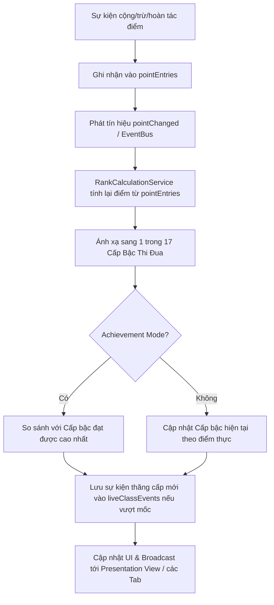

# Kế Hoạch Kỹ Thuật Module "Cấp Bậc Thi Đua" (Emulation Rank System)

> **Tài liệu Khảo sát & Thiết kế Kiến trúc Hệ thống Cấp bậc Thi đua**
> Dự án: Sổ Chủ Nhiệm Việt Offline (Local-First Desktop & Web App)
> Ngày lập: 14/08/2026

---

## 1. Kết Quả Khảo Sát Hệ Thống Điểm Hiện Tại

### 1.1 Cơ Sở Dữ Liệu Dexie / IndexedDB
- **Tên CSDL:** `SoChuNhiemVietOfflineDB`
- **Phiên bản CSDL (DB Version):** `version(4)` (Đã bao gồm bảng `pointEntries` có chỉ mục `sourceId`).
- **Cấu trúc bảng `pointEntries`:**
  ```typescript
  export type PointEntry = SoftDeleteEntity & {
    classId: string;
    studentId: string;
    categoryId: string;
    points: number;
    reason: string;
    occurredAt: string; // YYYY-MM-DD local format
    recordedBy?: string;
    source?: 'manual' | 'live_classroom';
    sourceId?: string | null;
    reversedEntryId?: string | null;
  };
  ```
- **Cấu trúc bảng `pointCategories`:**
  ```typescript
  export type PointCategory = SoftDeleteEntity & {
    name: string;
    type: 'Merit' | 'Demerit';
    defaultPoints: number;
    description?: string;
  };
  ```

### 1.2 Điểm Số & Cơ Chế Tính Điểm Hiện Tại
- **Điểm đang được tính:** Tổng tất cả `pointEntries.points` thuộc về học sinh/lớp mà `!deletedAt`.
- **Cơ chế Soft Delete:** Tất cả các entity kế thừa `SoftDeleteEntity` (gồm `pointEntries`). Khi tính điểm, hàm tính luôn lọc `!e.deletedAt`.
- **Cơ chế Reversal (Hoàn tác điểm):**
  - Khi giáo viên hoàn tác một điểm số, hệ thống **không xóa** bản ghi cũ.
  - Hệ thống tạo một `pointEntry` mới có `points = -original.points` và gán `reversedEntryId = original.id`.
  - Kết quả: Khi cộng dồn `pointEntries`, 2 bản ghi tự động triệt tiêu nhau về `0` điểm một cách chính xác và minh bạch.
- **Audit Log (`auditLogs`):** Mọi thao tác `CREATE`, `UPDATE`, `DELETE`, `REVERSE` đều ghi log với chi tiết `oldValue -> newValue`.
- **Sao lưu & Phục hồi (`BackupService`):** Export/Import toàn bộ 18+ bảng IndexedDB dưới dạng file mã hóa `.gvcn-backup`.

### 1.3 Hiệu Năng Truy Vấn & Cập Nhật Realtime
- **Tránh N+1 Query:** Khi tính điểm toàn lớp (ví dụ trong `CalledStudentsQueue` hoặc `LiveClassroomActivePage`), hệ thống nạp toàn bộ `pointEntries` của lớp trong **1 lượt query batch** bằng Dexie Array Filter (`db.pointEntries.filter((e) => e.sourceId === sessionId && !e.deletedAt).toArray()`), sau đó gom nhóm bằng `Map<string, number>`.
- **Cập nhật Realtime UI:**
  - Trong cùng tab: Thông qua callback state (`loadSessionData`) và React state hook.
  - Giữa các tab / Presentation View: Sử dụng `BroadcastChannel` API (`liveBroadcastService.postMessage`).

---

## 2. 17 Cấp Bậc Thi Đua & Quy Tắc Cốt Lõi

### 2.1 Danh Sách 17 Cấp Bậc
Hệ thống cấp bậc lấy cảm hứng từ danh hiệu khen thưởng quân đội (dành cho môi trường giáo dục thi đua học tập):

1. **Binh nhì** (0đ)
2. **Binh nhất** (50đ)
3. **Hạ sĩ** (100đ)
4. **Trung sĩ** (150đ)
5. **Thượng sĩ** (200đ)
6. **Thiếu úy** (250đ)
7. **Trung úy** (300đ)
8. **Thượng úy** (350đ)
9. **Đại úy** (400đ)
10. **Thiếu tá** (450đ)
11. **Trung tá** (500đ)
12. **Thượng tá** (550đ)
13. **Đại tá** (600đ)
14. **Thiếu tướng** (650đ)
15. **Trung tướng** (700đ)
16. **Thượng tướng** (750đ)
17. **Đại tướng** (800đ)

### 2.2 Chiến Lược "Không Lưu Trùng Tổng Điểm" (Single Source of Truth)
- **Tuyệt đối không thêm cột `totalPoints` hay `currentRank` vào bảng `students`.**
- Cấp bậc và tổng điểm được tính toán động 100% từ `pointEntries` (Derived State Pattern).
- Giúp đảm bảo tính toàn vẹn dữ liệu local-first, tránh lệch điểm khi hoàn tác hoặc restore backup.

---

## 3. Kiến Trúc Đề Xuất Cho Module Cấp Bậc Thi Đua

```
src/core/services/emulation-rank/
├── rank-system.service.ts      # Service chính quản lý quy trình cấp bậc
├── rank-calculation.service.ts # Thuật toán tính toán điểm & ánh xạ 17 cấp bậc
├── rank-history.service.ts     # Ghi nhận & truy vấn mốc lịch sử thăng cấp
└── rank.repository.ts          # Truy vấn dữ liệu cấp bậc từ Dexie
```

### 3.1 Luồng Xử Lý Điểm & Cấp Bậc (`pointChanged`)



### 3.2 Đề Xuất Các Hook React
- **`useStudentRank(studentId, classId)`**: Hook nạp và lắng nghe cấp bậc thi đua của 1 học sinh.
- **`useClassRankSummary(classId)`**: Hook nạp bảng tổng hợp cấp bậc cho toàn lớp học.

---

## 4. Đánh Giá Rủi Ro & Chiến Lược Sao Lưu / Phục Hồi

### 4.1 Rủi Ro Migration
- **Không có rủi ro schema break:** Do module tính toán hoàn toàn dựa trên dữ liệu `pointEntries` hiện có, không thêm trường mới vào bảng `students` hay `pointEntries`.
- **Hiệu năng:** Việc tính batch cho cả lớp được tối ưu thông qua Map hash-table trên bộ nhớ đệm client, đảm bảo thời gian xử lý < 5ms cho lớp 50 học sinh.

### 4.2 Chiến Lược Sao Lưu & Phục Hồi (Backup & Restore)
- Mọi dữ liệu điểm thi đua nằm trong `pointEntries` đã được bao phủ 100% trong `BackupService`.
- Khi restore file backup `.gvcn-backup`, hệ thống tự động phục hồi toàn bộ lịch sử điểm và cấp bậc thi đua được tính lại chính xác hoàn toàn.

---

## 5. Kết Luận
Kế hoạch kỹ thuật đảm bảo tuân thủ 100% nguyên tắc Local-First, không tạo dư thừa dữ liệu, bảo toàn tính năng điểm danh / phát biểu / lớp học trực tuyến hiện có.
