# SỔ CHỦ NHIỆM VIỆT OFFLINE — ĐẶC TẢ HỆ THỐNG (SYSTEM OVERVIEW)
> Mã tài liệu: `SPEC-00-OVERVIEW`  
> Phiên bản hệ thống: `1.0.0 (PWA Offline-First)`  
> Ngày lập: `20/08/2026`  
> Vai trò: Senior Business Analyst + Senior Software Architect + QA Lead  

---

## 1. Giới thiệu Tổng quan Dự án

**Sổ Chủ Nhiệm Việt Offline** (`so-chu-nhiem-viet-offline`) là giải pháp phần mềm quản lý lớp học và nghiệp vụ công tác giáo viên chủ nhiệm dành cho các trường phổ thông (Tiểu học, THCS, THPT) tại Việt Nam.

### 1.1. Triết lý Thiết kế Cốt lõi
1. **100% Offline-First**: Ứng dụng hoạt động hoàn toàn độc lập trong trình duyệt, không phụ thuộc vào internet, không có backend máy chủ trung gian, giúp giáo viên sử dụng mượt mà tại mọi điểm trường học đường.
2. **0% Telemetry & Bảo mật Tuyệt đối**: Toàn bộ hồ sơ học sinh, hoàn cảnh gia đình, nhật ký phụ huynh, điểm số thi đua và đánh giá học tập được lưu trữ cục bộ trong cơ sở dữ liệu IndexedDB trên thiết bị cá nhân của giáo viên.
3. **Sư phạm Đổi mới & Gamification Giáo dục**: Tích hợp hệ sinh thái thi đua gồm hệ thống 17 Cấp bậc Quân hàm Đội viên, 5 Cấp bậc Avatar Tiến hóa đồng bộ, Bảng Vàng Danh hiệu (theo Thông tư Bộ GD&ĐT), và Lớp học Trực tuyến tương tác trực quan (Live Classroom) hỗ trợ máy chiếu màn hình lớn.
4. **Chuẩn hóa Đánh giá Học sinh theo Thông tư**: Tích hợp đầy đủ khung tiêu chí đánh giá phẩm chất, năng lực và nhận xét định kỳ theo **Thông tư 22/2021/TT-BGDĐT** (THCS/THPT) và **Thông tư 27/2020/TT-BGDĐT** (Tiểu học).

---

## 2. Kiến trúc Công nghệ Toàn diện (Tech Stack Architecture)

```mermaid
graph TD
    subgraph UI_Layer [Giao diện Người dùng & Tương tác]
        React19[React 19 + TypeScript 5.7]
        TailwindCSS[Tailwind CSS v4 + Fluid Clamping]
        Router[React Router DOM v7 - 37 Routes]
        Icons[Lucide React Icons]
        Charts[Recharts - Data Visualization]
    end

    subgraph State_Sync [State Management & Realtime Sync]
        ToastCtx[Toast Context System]
        UiScale[UI Scale & Presentation Mode Hook]
        Broadcast[BroadcastChannel API - Đa Màn hình Không Dây]
        AudioEngine[Web Audio API Synthesizer & SFX]
        Confetti[Canvas Confetti Particles Engine]
    end

    subgraph Core_Services [Tầng Nghiệp vụ Sư phạm - 72 Services]
        RankEngine[RankCalculation & Promotion Service]
        AvatarSync[AvatarCardTheme & ThemeRegistry]
        HonorEngine[HonorRuleEngine & Seed Service]
        EvalEngine[EvaluationProfile & Validation TT22/TT27]
        GiftEngine[GiftRedemption & Stock Movement Service]
        AttendanceSvc[Attendance & Lock Service]
        ExcelSvc[ExcelJS Export/Import Template Engine]
        BackupSvc[Web Crypto AES-GCM Backup Engine]
    end

    subgraph Storage_Layer [Tầng Lưu trữ Cục bộ Client-Side]
        DexieDB[(IndexedDB - Dexie.js v4)]
        TableSchema[30 Bảng Thực thể & Schema v1 -> v14]
        AuditLogs[(auditLogs - Lưu vết lịch sử thay đổi)]
        LocalStorage[(LocalStorage - Settings & Active Keys)]
    end

    UI_Layer --> State_Sync
    State_Sync --> Core_Services
    Core_Services --> Storage_Layer
```



### 2.1. Chi tiết Ngăn xếp Công nghệ (Technology Stack)

| Phân tầng | Công nghệ / Thư viện | Phiên bản | Mục đích sử dụng |
| :--- | :--- | :--- | :--- |
| **Core Framework** | React + TypeScript | `19.0.0` / `5.7.3` | Nền tảng SPA xây dựng component hiệu năng cao |
| **Build Tool & Bundler** | Vite | `6.1.0` | Dev server HMR siêu tốc và tối ưu hóa bundle |
| **PWA & Caching** | vite-plugin-pwa (Workbox) | `0.21.1` | Service Worker precache tài nguyên, cài đặt Desktop App |
| **Styling & Design System** | Tailwind CSS + Lucide Icons | `4.0.6` / `0.475.0` | Utility CSS tokens, responsive và icon chuẩn hóa |
| **Routing** | React Router DOM | `7.1.5` | Điều hướng client-side, dynamic route matching |
| **Database Engine** | Dexie.js (IndexedDB wrapper) | `4.0.10` | Cơ sở dữ liệu NoSQL client-side, hỗ trợ ACID transactions |
| **Biểu đồ & Thống kê** | Recharts | `3.10.1` | Vẽ biểu đồ cột, tròn, radar, đường xu hướng |
| **Xử lý Bảng tính** | ExcelJS | `4.4.0` | Đọc/ghi file `.xlsx` định dạng màu, border, công thức chuẩn |
| **Validation Schema** | Zod | `3.24.2` | Ràng buộc kiểu dữ liệu form và import validation |
| **Âm thanh Hiệu ứng** | Web Audio API / AudioContext | Native Browser | Phát âm thanh tương tác sư phạm không cần file ngoài |
| **Đồng bộ Đa Màn hình** | BroadcastChannel API | Native Browser | Đồng bộ điều khiển giáo viên sang máy chiếu học sinh |
| **Kiểm thử Tự động** | Vitest + Testing Library | `3.0.5` / `16.2.0` | 69 test suites / 359 tests (100% Pass Rate) |

---

## 3. Bản đồ Chức năng Tổng thể (System Feature Map)

```text
SỔ CHỦ NHIỆM VIỆT OFFLINE
├── 1. ONBOARDING & HỒ SƠ GIÁO VIÊN
│   ├── Khởi tạo hồ sơ giáo viên (Họ tên, danh xưng, trường, tổ bộ môn, avatar)
│   ├── Cấu hình năm học đầu tiên & thiết lập lớp chủ nhiệm ban đầu
│   └── Kiểm tra bắt buộc hoàn tất Onboarding trước khi vào Dashboard
│
├── 2. BÀN LÀM VIỆC TỔNG QUAN (DASHBOARD)
│   ├── Hero Card: Lời chào buổi sáng sư phạm & Avatar giáo viên nổi bật
│   ├── Thống kê nhanh KPI: Sĩ số, tỷ lệ điểm danh ngày, số học sinh đạt cấp bậc cao
│   ├── Lối tắt 1 chạm: Điểm danh hôm nay, Mở lớp trực tuyến, Gọi tên ngẫu nhiên
│   ├── Gương mặt nổi bật (Top điểm thi đua) & Học sinh cần đồng hành nề nếp
│   └── Lịch công tác tuần & Ghi chú nhiệm vụ sư phạm trong ngày
│
├── 3. QUẢN LÝ NĂM HỌC & HỌC KỲ
│   ├── Danh sách năm học (Active/Archived), ngày bắt đầu - ngày kết thúc
│   ├── Quản lý học kỳ (Học kỳ 1, Học kỳ 2, Cả năm)
│   └── Cảnh báo thông minh ngoài khoảng thời gian học kỳ (TermDateWarningBanner)
│
├── 4. QUẢN LÝ LỚP HỌC & PHÂN LỚP
│   ├── Danh sách lớp học theo khối (Khối 1 -> Khối 12)
│   ├── Chi tiết lớp học, danh sách học sinh theo lớp, sĩ số nam/nữ
│   ├── Thêm mới, chỉnh sửa thông tin lớp, đóng/lưu trữ lớp học (Archived)
│   └── Chuyển lớp học sinh & bảo toàn lịch sử phân lớp (ClassEnrollment)
│
├── 5. HỒ SƠ HỌC SINH & LIÊN LẠC PHỤ HUYNH
│   ├── Quản lý danh sách học sinh, chuẩn hóa họ tên tiếng Việt (TCVN3/Unicode)
│   ├── Bộ sưu tập 31+ Avatar Vector SVG theo chủ đề (Học đường, Động vật, Cổ tích...)
│   ├── Hệ thống 5 Cấp bậc Avatar Tiến hóa đồng bộ (Novice -> Grandmaster)
│   ├── Chi tiết học sinh: Dòng thời gian thi đua, biểu đồ tăng trưởng điểm, nhật ký
│   └── Danh bạ phụ huynh, quản lý người giám hộ chính, xếp hàng gọi khẩn cấp
│
├── 6. ĐIỂM DANH HỌC SINH
│   ├── Điểm danh 1 chạm theo ngày với 5 trạng thái (Có mặt, Trễ, Phép, Không phép, Về sớm)
│   ├── Khóa sổ điểm danh (Lock Session) chống vô tình chỉnh sửa sai dữ liệu
│   └── Lịch sử chuyên cần, biểu đồ tỷ lệ chuyên cần theo tuần/tháng/học kỳ
│
├── 7. NỀ NẾP & ĐIỂM THI ĐUA (CONDUCT & MERIT POINTS)
│   ├── Sổ điểm thi đua với danh mục tiêu chí Cộng (+) / Trừ (-) điểm chuẩn hóa
│   ├── Chấm điểm thi đua linh hoạt: Chấm đơn lẻ, chấm nhiều học sinh, chấm cả nhóm
│   ├── Cơ chế Hoàn tác điểm (Undo Point Entry) khôi phục số dư ngay lập tức
│   └── Bảng theo dõi biến động điểm thi đua và phân tích học sinh tích cực
│
├── 8. HỆ THỐNG CẤP BẬC QUÂN HÀM & VINH DANH (RANK SYSTEM)
│   ├── 17 Cấp bậc Quân hàm Đội viên từ Binh nhì (0đ) đến Đại tướng (800đ)
│   ├── Chế độ tính điểm Tích lũy (Achievement Mode) - Chống tụt cấp khi bị trừ điểm nề nếp
│   ├── Hàng đợi chúc mừng thăng cấp (LevelUpCelebrationQueue) với pháo hoa & âm thanh
│   └── Bảng theo dõi học sinh sát ngưỡng thăng cấp để giáo viên khích lệ
│
├── 9. BẢNG VÀNG DANH HIỆU (HONOR BOARD)
│   ├── 8 Danh hiệu sư phạm chuẩn hóa (Dẫn đầu cấp bậc, Thăng cấp ấn tượng, Ngôi sao bứt phá...)
│   ├── Rule Engine tự động phân tích và tính toán đề xuất học sinh xứng đáng
│   ├── Modal giải quyết hòa điểm (Tie Resolution Modal) thông minh
│   ├── Trình chiếu Bảng Vàng toàn màn hình (Full HD/4K) cho tiết sinh hoạt lớp
│   └── Quản lý lịch sử và lưu trữ các kỳ xét Bảng Vàng
│
├── 10. ĐÁNH GIÁ HỌC SINH (THÔNG TƯ 22 & THÔNG TƯ 27)
│   ├── Đánh giá định kỳ theo quy định Bộ GD&ĐT (Giữa kỳ 1, Cuối kỳ 1, Giữa kỳ 2, Cuối năm)
│   ├── Tiêu chí đánh giá phẩm chất chủ yếu (Yêu nước, Nhân ái, Chăm chỉ, Trung thực, Trách nhiệm)
│   ├── Tiêu chí đánh giá năng lực cốt lõi (Tự chủ, Giao tiếp, Giải quyết vấn đề)
│   ├── Ngân hàng mẫu nhận xét chuẩn sư phạm có gợi ý thông minh
│   └── Kiểm tra tính hợp lệ & cảnh báo thiếu sót dữ liệu trước khi khóa sổ
│
├── 11. CỬA HÀNG QUÀ TẶNG & ĐỔI THƯỞNG (GIFTS & REWARDS)
│   ├── Danh mục quà tặng học tập phong phú với điểm đổi thưởng tương ứng
│   ├── Quản lý kho quà: Theo dõi số lượng tồn kho và lịch sử biến động nhập/xuất
│   ├── Đổi quà cho học sinh: Kiểm tra số dư điểm, trừ kho và xuất biên nhận đổi quà
│   └── Chế độ trình chiếu Cửa hàng quà tặng trên máy chiếu lớp học
│
├── 12. ĐIỀU HÀNH LỚP HỌC TRỰC TUYẾN (LIVE CLASSROOM)
│   ├── Tạo và quản lý phiên lớp học tương tác thời gian thực
│   ├── Lưới thẻ học sinh Fluid Clamping Responsive tự động co giãn theo độ phân giải
│   ├── Hộp công cụ sư phạm nổi (Floating Toolbox):
│   │   ├── Bốc thăm ngẫu nhiên (Random Picker) với âm thanh kịch tính & loại trừ đã gọi
│   │   ├── Hàng đợi giơ tay phát biểu (Hand Raised Queue)
│   │   ├── Bầu chọn & Khảo sát nhanh (Quick Poll) biểu đồ trực quan
│   │   ├── Đồng hồ đếm ngược & Báo thức (Timer/Stopwatch)
│   │   ├── Bảng trắng tương tác (Interactive Whiteboard)
│   │   ├── Màn hình giải lao / Nghỉ giữa giờ (Break Screen)
│   │   └── Trình tạo mã QR động (QR Generator) chia sẻ tài liệu bài giảng
│   ├── Chia nhóm học tập ngẫu nhiên và chấm điểm thi đua đồng loạt theo nhóm
│   └── Đồng bộ 2 màn hình không dây qua BroadcastChannel API (Màn hình điều khiển <-> Máy chiếu)
│
├── 13. TRUNG TÂM BÁO CÁO & THỐNG KÊ (REPORTS & ANALYTICS)
│   ├── Báo cáo tổng quan KPI lớp chủ nhiệm
│   ├── Biểu đồ phân tích chuyên cần, xu hướng điểm thi đua và thăng cấp
│   ├── So sánh đối sánh giữa các lớp học trong cùng khối
│   ├── Phiếu nhận xét & Hồ sơ cá nhân học sinh chuẩn in ấn A4 (PDF Export)
│   └── Chế độ trình chiếu báo cáo toàn màn hình (Auto-Slide Presentation)
│
├── 14. SAO LƯU, PHỤC HỒI & QUYỀN RIÊNG TƯ
│   ├── Sao lưu toàn bộ cơ sở dữ liệu thành file `.gvcn-backup` có nén và mã hóa
│   ├── Khôi phục an toàn cơ sở dữ liệu với chế độ Ghi đè hoặc Hợp nhất
│   ├── Thùng rác hệ thống (Trash Bin) hỗ trợ khôi phục hoặc xóa vĩnh viễn (Soft Delete)
│   ├── Nhật ký kiểm toán (Audit Logs) ghi lại mọi thao tác thêm/sửa/xóa của giáo viên
│   └── Bảng kiểm tra sức khỏe lưu trữ (Storage Health & IndexedDB Capacity)
│
└── 15. CÀI ĐẶT HỆ THỐNG & TÙY BIẾN GIAO DIỆN
    ├── Đổi chủ đề giao diện (Quân đội, Đáng yêu, Cyberpunk, Thiên nhiên, Vũ trụ...)
    ├── Tùy chỉnh tỷ lệ hiển thị UI (UI Scale từ 80% đến 130%)
    ├── Quản lý ngân hàng mẫu ảnh Avatar tùy chỉnh (Custom Avatar Assets)
    └── Hỗ trợ cài đặt PWA và cập nhật phiên bản ứng dụng ngoại tuyến
```
