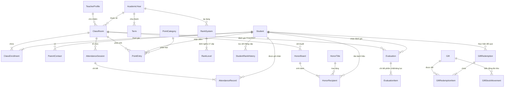

# ĐẶC TẢ CƠ SỞ DỮ LIỆU: DATA MODEL & INDEXEDDB SCHEMA (v1 -> v14)
> Mã tài liệu: `SPEC-14-DATA-MODEL`  
> Phân hệ: Cấu trúc Dữ liệu, Chỉ mục & Lịch sử Nâng cấp Schema  

---

## 1. Danh Sách 30 Bảng Thực Thể Trong IndexedDB

| STT | Tên Bảng (Dexie Table) | Khóa Chính | Các Trường Đánh Chỉ Mục (Indexes) | Ý Nghĩa Thực Thể |
| :---: | :--- | :---: | :--- | :--- |
| 1 | `teacherProfiles` | `id` | `phone` | Hồ sơ cá nhân của giáo viên chủ nhiệm |
| 2 | `academicYears` | `id` | `name, isActive` | Năm học |
| 3 | `terms` | `id` | `academicYearId, isActive, [academicYearId+isActive]` | Học kỳ trong năm học |
| 4 | `classes` | `id` | `academicYearId, name, status, deletedAt, [academicYearId+deletedAt]` | Lớp học |
| 5 | `students` | `id` | `studentCode, normalizedName, deletedAt` | Hồ sơ học sinh |
| 6 | `classEnrollments` | `id` | `classId, studentId, &[classId+studentId], status` | Phân lớp học sinh & lịch sử chuyển lớp |
| 7 | `parentContacts` | `id` | `studentId, isPrimary` | Thông tin người giám hộ & phụ huynh |
| 8 | `attendanceSessions` | `id` | `classId, termId, sessionDate, &[classId+sessionDate]` | Phiên điểm danh theo ngày |
| 9 | `attendanceRecords` | `id` | `sessionId, studentId, status, &[sessionId+studentId]` | Bản ghi chuyên cần từng học sinh |
| 10 | `pointCategories` | `id` | `name, type` | Tiêu chí chấm điểm thi đua (Merit/Demerit) |
| 11 | `pointEntries` | `id` | `classId, studentId, categoryId, sourceId, occurredAt, [classId+occurredAt], [studentId+occurredAt]` | Lịch sử cộng/trừ điểm thi đua |
| 12 | `studentNotes` | `id` | `classId, studentId, termId` | Ghi chú sư phạm riêng về học sinh |
| 13 | `evaluations` | `id` | `classId, studentId, academicYearId, termId, periodCode, regulationCode, status, deletedAt, &[classId+studentId+academicYearId+periodCode]` | Đánh giá định kỳ TT22/TT27 |
| 14 | `evaluationItems` | `id` | `evaluationId, domain, criterionCode, subjectCode, deletedAt, &[evaluationId+domain+criterionCode]` | Chi tiết tiêu chí phẩm chất/năng lực |
| 15 | `evaluationCommentTemplates`| `id` | `catalogVersion, regulationCode, domain, criterionCode, levelCode, origin, isFavorite, isActive, deletedAt` | Ngân hàng mẫu nhận xét sư phạm |
| 16 | `parentInteractions` | `id` | `classId, studentId, interactionDate` | Nhật ký trao đổi với phụ huynh |
| 17 | `rewards` | `id` | `classId, studentId, termId, date` | Khen thưởng & danh hiệu thành tích |
| 18 | `settings` | `id` | - | Cài đặt hệ thống & cấu hình người dùng |
| 19 | `auditLogs` | `id` | `entityName, recordId, timestamp` | Nhật ký kiểm toán thao tác hệ thống |
| 20 | `backupHistory` | `id` | `createdAt` | Lịch sử sao lưu & phục hồi dữ liệu |
| 21 | `liveClassSessions` | `id` | `classId, sessionDate, status` | Phiên lớp học trực tuyến tương tác |
| 22 | `liveClassParticipants` | `id` | `sessionId, studentId, &[sessionId+studentId], attendanceStatus` | Học sinh tham gia trong phiên trực tuyến |
| 23 | `liveClassGroups` | `id` | `sessionId` | Nhóm học tập trong phiên trực tuyến |
| 24 | `liveClassGroupMembers` | `id` | `groupId, studentId, &[groupId+studentId]` | Thành viên trong nhóm học tập |
| 25 | `liveClassEvents` | `id` | `sessionId, eventType, createdAt` | Sự kiện tương tác (bốc thăm, bầu chọn) |
| 26 | `rankSystems` | `id` | `academicYearId, isActive, [academicYearId+isActive]` | Hệ thống cấp bậc thi đua của năm |
| 27 | `rankSystemClasses` | `id` | `rankSystemId, classId, &[rankSystemId+classId]` | Ánh xạ hệ thống cấp bậc theo lớp |
| 28 | `rankLevels` | `id` | `rankSystemId, level, code, &[rankSystemId+level], &[rankSystemId+code]` | 17 Cấp bậc quân hàm chi tiết |
| 29 | `studentRankHistory` | `id` | `rankSystemId, classId, studentId, createdAt, [studentId+createdAt]` | Lịch sử thăng cấp quân hàm học sinh |
| 30 | `honorTitles` | `id` | `code, calculationType, isActive, sortOrder, createdAt, deletedAt` | 8 Danh hiệu Bảng Vàng chuẩn hóa |
| 31 | `honorBoards` | `id` | `classId, academicYearId, termId, status, startDate, endDate, periodType, createdAt, deletedAt, [classId+startDate+endDate]` | Bảng Vàng vinh danh theo kỳ |
| 32 | `honorRecipients` | `id` | `boardId, titleId, studentId, isApproved, &[boardId+titleId+studentId], createdAt` | Danh sách học sinh nhận danh hiệu |
| 33 | `gifts` | `id` | `name, normalizedName, status, category, pointCost, inventoryMode, displayOrder, presentationVisible, deletedAt` | Quà tặng trong cửa hàng đổi thưởng |
| 34 | `giftRedemptions` | `id` | `studentId, classId, academicYearId, termId, status, redeemedAt, &idempotencyKey, [studentId+redeemedAt], [classId+redeemedAt], deletedAt` | Giao dịch đổi quà của học sinh |
| 35 | `giftRedemptionItems` | `id` | `redemptionId, giftId, [redemptionId+giftId], deletedAt` | Chi tiết món quà trong đơn đổi thưởng |
| 36 | `giftStockMovements` | `id` | `giftId, type, occurredAt, createdAt, [giftId+occurredAt]` | Lịch sử biến động xuất/nhập tồn kho quà |
| 37 | `giftImages` | `id` | `&giftId, updatedAt` | Ảnh đại diện quà tặng (tách bảng tối ưu) |
| 38 | `rankPromotionEvents` | `id` | `classId, studentId, liveSessionId, status, createdAt, [classId+status+createdAt], [liveSessionId+status+createdAt], [studentId+sourcePointEntryId]` | Sự kiện thăng cấp cần chúc mừng |
| 39 | `avatarAssets` | `id` | `targetLevel, createdAt` | Ngân hàng asset avatar tùy chỉnh theo cấp |
| 40 | `levelUpCelebrationEvents`| `id`| `&dedupeKey, classId, studentId, liveSessionId, status, createdAt, [classId+status+createdAt], [liveSessionId+status+createdAt]` | Hàng đợi vinh danh chống trùng lặp |

---

## 2. Sơ Đồ Quan Hệ Thực Thể Chính (Entity Relationship Diagram)

---

## 3. Lịch Sử Nâng Cấp Schema (Database Migrations v1 -> v14)

- **Version 1**: Khởi tạo cấu trúc cốt lõi (18 bảng ban đầu: giáo viên, năm học, lớp, học sinh, điểm danh, điểm thi đua, cài đặt, audit).
- **Version 2**: Tối ưu chỉ mục lớp học (`academicYearId, name, status, deletedAt`).
- **Version 3**: Bổ sung phân hệ Lớp học trực tuyến (`liveClassSessions`, `participants`, `groups`, `events`).
- **Version 4**: Tối ưu chỉ mục `pointEntries` cho truy vấn nhanh theo ngày.
- **Version 5**: Bổ sung hệ thống Cấp bậc Quân hàm (`rankSystems`, `rankLevels`, `studentRankHistory`).
- **Version 6**: Bổ sung phân hệ Bảng Vàng Danh hiệu (`honorTitles`, `honorBoards`, `honorRecipients`).
- **Version 7**: Thêm chỉ mục ghép `[classId+occurredAt]`, `[studentId+occurredAt]` cho `pointEntries`.
- **Version 8**: Đại tu phân hệ Đánh giá Học sinh theo Thông tư 22 & Thông tư 27 (`evaluations`, `evaluationItems`, `evaluationCommentTemplates`) kèm script tự động migrate dữ liệu cũ.
- **Version 9**: Bổ sung phân hệ Cửa Hàng Quà Tặng & Đổi Thưởng (`gifts`, `giftRedemptions`, `giftRedemptionItems`, `giftStockMovements`).
- **Version 10**: Tách bảng lưu trữ ảnh quà tặng `giftImages` có khóa ngoại `&giftId` để tối ưu tốc độ đọc bảng `gifts`.
- **Version 11**: Bổ sung bảng sự kiện thăng cấp `rankPromotionEvents` phục vụ realtime overlay.
- **Version 12 & 13**: Bổ sung bảng `avatarAssets` có chỉ mục `targetLevel` phục vụ 5 Cấp bậc Avatar Tiến hóa.
- **Version 14**: Bổ sung bảng `levelUpCelebrationEvents` với khóa độc bản `&dedupeKey` triệt tiêu lỗi trùng lặp khi vinh danh thăng cấp.
