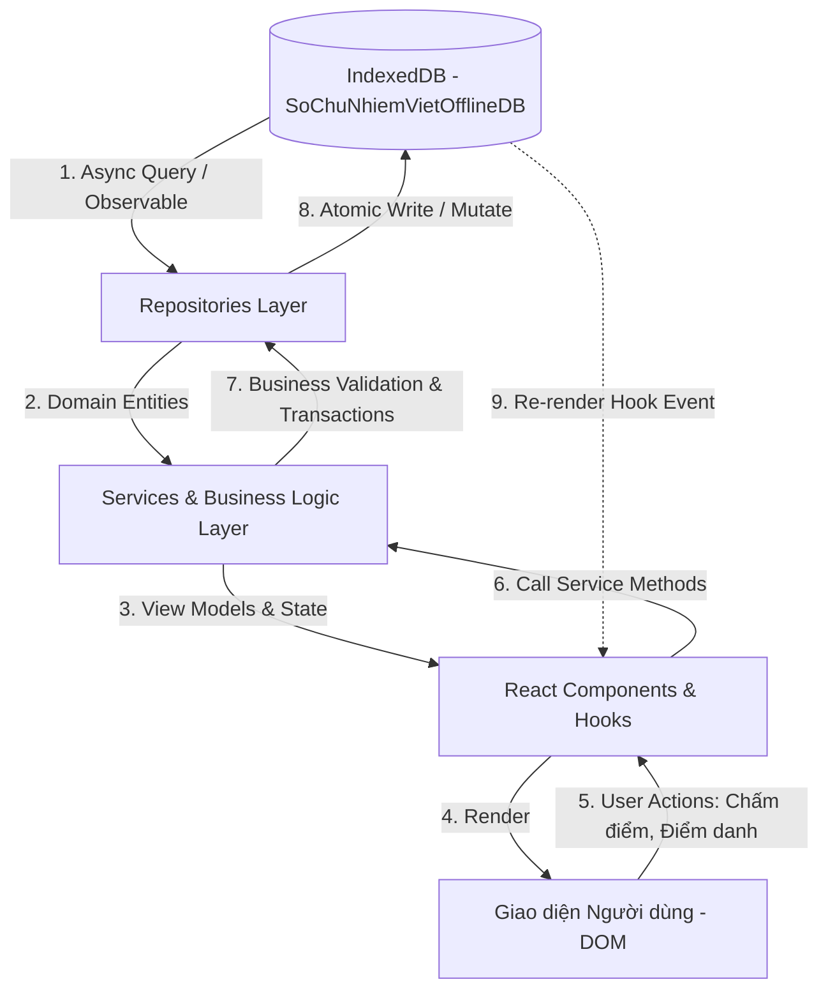

# ĐẶC TẢ KIẾN TRÚC LƯU TRỮ & ĐỒNG BỘ DỮ LIỆU (STORAGE & SYNC ARCHITECTURE)
> Mã tài liệu: `SPEC-15-STORAGE-SYNC`  
> Phân hệ: Cơ chế Lưu trữ, Source of Truth & Xử lý Đồng thời  

---

## 1. Ma Trận Lưu Trữ Dữ Liệu Toàn Hệ Thống

| Nhóm Dữ Liệu | Nơi Lưu Trữ Chính | Tên Bảng / Key | Cơ Chế Đọc/Ghi | Mất khi Reload? |
| :--- | :--- | :--- | :--- | :---: |
| **Dữ liệu Nghiệp vụ Sư phạm** (Lớp, Học sinh, Điểm danh, Điểm thi đua, Danh hiệu, Quà tặng, Đánh giá) | **IndexedDB** (`SoChuNhiemVietOfflineDB`) | 30 Bảng thực thể | Dexie Repositories & ACID Transactions | **KHÔNG** |
| **Cài đặt Hệ thống** (ID Năm học hiện tại, ID Lớp đang chọn, Trạng thái Onboarding) | **IndexedDB** | `settings` (ID: `'default-settings'`) | `settingsRepository.getSettings()` | **KHÔNG** |
| **Chủ đề Giao diện** (Military, Cute, Cyberpunk...) | **LocalStorage** | Key: `gvcn_theme_id` | Hook `useTheme` | **KHÔNG** |
| **Tỷ lệ Thu phóng Giao diện** (80% - 130%) | **LocalStorage** | Key: `gvcn_ui_scale` | Hook `useUiScale` | **KHÔNG** |
| **Thông báo Tạm thời** (Toast Messages) | **React Memory State** | `ToastContext.tsx` | Dispatch action | **CÓ** |
| **Trạng thái Phiên Trình chiếu** (Trang slide hiện tại, Dữ liệu đồng bộ máy chiếu) | **BroadcastChannel API** | Channel: `live_classroom_channel` | Message Event Listener | Tự đồng bộ lại |

---

## 2. Mô Hình Nguồn Dữ Liệu Chuẩn (Single Source of Truth)

---

## 3. Cơ Chế Chống Ghi Đè & Khóa Bất Đồng Bộ (Concurrency & Race Condition Prevention)

1. **Khóa In-Flight Promise Locks**:
   - Áp dụng trong các dịch vụ khởi tạo dữ liệu mặc định (`honorTitleSeedService`, `rankSeedService`, `evaluationTemplateSeedService`).
   - Khi nhiều component gọi hàm khởi tạo cùng một thời điểm (ví dụ React double-mounting trong StrictMode), hệ thống gán Promise đang chạy vào biến thành viên `private seedPromise` để các lệnh gọi sau tự động chờ cùng một kết quả, triệt tiêu 100% khả năng sinh bản ghi trùng lặp.
2. **Dexie ACID Transactions (`db.runTransaction`)**:
   - Khi thực hiện các nghiệp vụ phức tạp (Đổi quà: trừ kho + trừ điểm thi đua; Điểm danh hàng loạt; Import Excel), toàn bộ các thao tác được bọc trong 1 Transaction Read-Write duy nhất.
   - Nếu xảy ra bất kỳ lỗi validation nào ở bất kỳ bước nào, toàn bộ giao dịch sẽ tự động Rollback nguyên trạng, không bao giờ để lại dữ liệu rác hay trạng thái nửa vời.
3. **Idempotency Keys**:
   - Các giao dịch nhạy cảm như Đổi quà (`GiftRedemption`) và Sự kiện Vinh danh Thăng cấp (`LevelUpCelebrationEvent`) đều sinh khóa duy nhất `idempotencyKey` / `dedupeKey` gắn với ID học sinh và ID điểm gốc, ngăn chặn việc người dùng double-click gây nhân đôi giao dịch.
