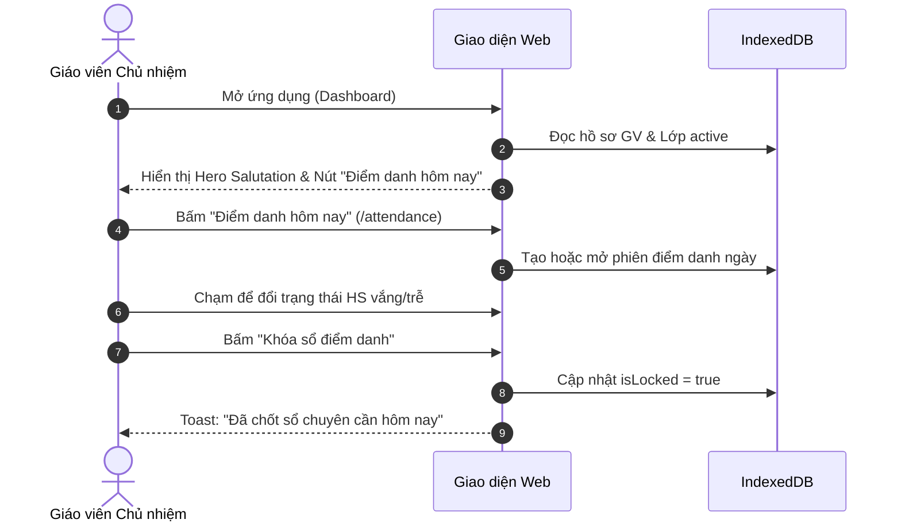
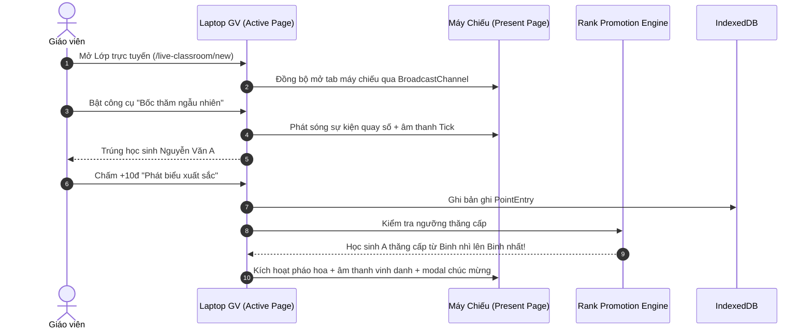
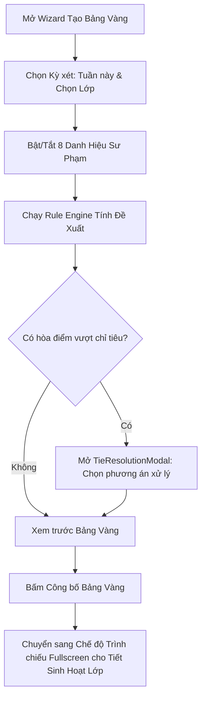
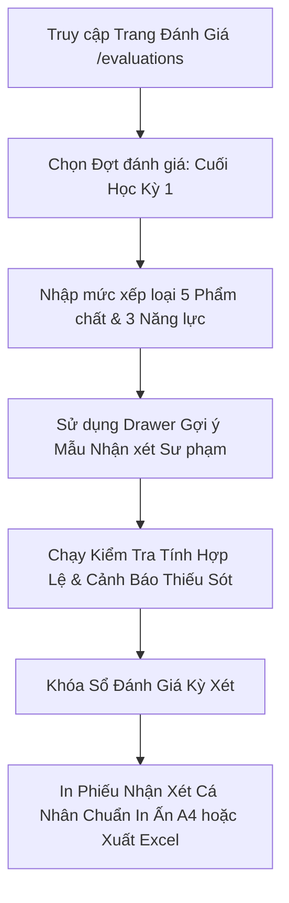

# ĐẶC TẢ MA TRẬN PHÂN QUYỀN & LUỒNG NGƯỜI DÙNG (PERMISSIONS & USER FLOWS)
> Mã tài liệu: `SPEC-17-PERMISSIONS-FLOWS`  
> Phân hệ: Quyền Hạn Sử Dụng & 4 Luồng Nghiệp Vụ Sư Phạm Cốt Lõi  

---

## 1. Ma Trận Phân Quyền Sử Dụng (Permission Matrix)

Do tính chất ứng dụng **Client-Side PWA 100% Offline**, quyền truy cập được quản lý dựa trên **Chế độ Vận hành (Operating Mode)**:

| Chức Năng / Nghiệp Vụ | Chế Độ Giáo Viên (Admin/Owner Mode) | Chế Độ Trình Chiếu Học Sinh (Presentation Mode) | Ghi Chú Bảo Mật |
| :--- | :---: | :---: | :--- |
| **Quản lý Năm học & Lớp học** | ✓ Cho phép | ✗ Ẩn hoàn toàn | Bảo vệ cấu trúc hệ thống |
| **Thêm, sửa, xóa hồ sơ học sinh** | ✓ Cho phép | ✗ Ẩn hoàn toàn | Bảo vệ thông tin cá nhân |
| **Xem số điện thoại, địa chỉ phụ huynh**| ✓ Cho phép | ✗ Ẩn hoàn toàn | Tuân thủ quyền riêng tư (Privacy) |
| **Thực hiện điểm danh & Chấm điểm thi đua**| ✓ Cho phép | ✗ Ẩn hoàn toàn | Chỉ giáo viên có quyền cho điểm |
| **Xem Lớp học trực tuyến tương tác** | ✓ Bảng điều khiển | ✓ Màn hình máy chiếu | Tự động đồng bộ 2 chiều |
| **Bốc thăm ngẫu nhiên, Bầu chọn** | ✓ Điều khiển vòng quay | ✓ Xem kết quả trúng | Trực quan, công bằng |
| **Xem Bảng Vàng vinh danh** | ✓ Phê duyệt & Chỉnh sửa | ✓ Trình chiếu Fullscreen | Tôn vinh trước tập thể |
| **Xem & Đổi quà trong Cửa hàng** | ✓ Xác nhận trừ kho | ✓ Xem danh mục quà | Khích lệ học tập |
| **Đánh giá học sinh theo TT22/TT27** | ✓ Nhập nhận xét, lưu sổ | ✗ Ẩn hoàn toàn | Nghiệp vụ nội bộ giáo viên |
| **Sao lưu & Khôi phục cơ sở dữ liệu** | ✓ Toàn quyền sao lưu | ✗ Ẩn hoàn toàn | Mã hóa mật khẩu bảo vệ |

---

## 2. Bốn Luồng Thao Tác Nghiệp Vụ Chính (Core User Flows)

### 2.1. Luồng Đầu Ngày: Điểm Danh & Khởi Động Tiết Học (Daily Morning Flow)

### 2.2. Luồng Trong Tiết Học: Lớp Trực Tuyến & Chấm Điểm (Live Classroom & Scoring Flow)

### 2.3. Luồng Cuối Tuần: Xét Duyệt & Trình Chiếu Bảng Vàng (Weekly Honor Board Flow)

### 2.4. Luồng Cuối Kỳ: Đánh Giá TT22/TT27 & Xuất Học Bạ A4 (Term-End Evaluation Flow)

