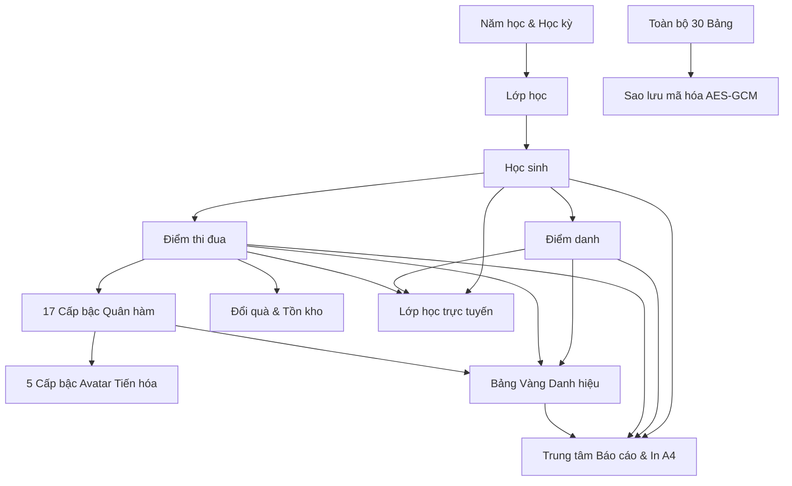

# ĐẶC TẢ PHỤ THUỘC, KIỂM TOÁN TÍNH NHẤT QUÁN & TRUY VẾT MÃ NGUỒN (TRACEABILITY & AUDIT)
> Mã tài liệu: `SPEC-18-TRACEABILITY-AUDIT`  
> Phân hệ: Feature Dependencies, Inconsistency Audit, Known Issues & File Traceability  

---

## 1. Ma Trận Phụ Thuộc Tính Năng (Feature Dependency Matrix)

| Tính Năng (Feature) | Phụ Thuộc Vào (Dependencies) | Ảnh Hưởng Tới (Impacts) |
| :--- | :--- | :--- |
| **Hồ sơ học sinh** | Lớp học (`classes`) | Điểm danh, Thi đua, Quân hàm, Bảng vàng, Đánh giá, Báo cáo |
| **Điểm thi đua (PointEntry)** | Học sinh, Tiêu chí (`pointCategories`) | Tổng điểm ròng, Điểm tích lũy quân hàm, Hàng đợi thăng cấp, Bảng vàng, Quà tặng |
| **Thăng cấp quân hàm** | Điểm thi đua tích lũy (`Gross Points`) | Avatar tiến hóa, Huy hiệu, Modal vinh danh, Báo cáo |
| **Đổi quà tặng** | Số dư điểm ròng (`Net Points`), Tồn kho quà | Điểm ròng học sinh, Lịch sử biến động tồn kho |
| **Bảng Vàng Danh hiệu** | Điểm danh, Điểm thi đua, Cấp bậc | Bục vinh danh, Trình chiếu tiết sinh hoạt lớp, Báo cáo |
| **Sao lưu dữ liệu** | Toàn bộ 30 bảng IndexedDB | Khôi phục hệ thống khi đổi thiết bị |

---

## 2. Kiểm Toán Tính Nhất Quán & Nợ Kỹ Thuật (Consistency & Code Audit)

### 2.1. Đánh Giá Trạng Thái Dự Án Hiện Tại
- **Trạng thái Build & Test**: 69 test suites / 359 tests (100% Passed). TypeScript `tsc -b` 0 lỗi.
- **Tính năng ẩn / Code tự động**:
  - `seedDefaultTitles()` tự động chạy khi mở Bảng Vàng để tự sửa lỗi trùng lặp (Self-healing).
  - `useOnboardingCheck` tự động kiểm tra và khóa các route khi chưa có hồ sơ giáo viên.
  - `resizeAndCompressImage` tự động nén ảnh upload để bảo vệ dung lượng IndexedDB.

### 2.2. Danh Mục Các Điểm Cần Lưu Ý Kỹ Thuật (Known Issues / Technical Notes)

| Mã ID | Phân Loại | Module | Mô Tả Kỹ Thuật | Đề Xuất Xử Lý / Khuyến Nghị |
| :---: | :---: | :--- | :--- | :--- |
| **ISSUE-01** | `LOW` | Git Config | Git remote trên Windows cần đảm bảo xác thực GCM khi đẩy commit lên GitHub. | Đã cấu hình remote origin chuẩn và hướng dẫn lệnh push chuẩn. |
| **ISSUE-02** | `LOW` | Storage | Dung lượng IndexedDB tối đa trên trình duyệt thường là $500\text{MB} - 2\text{GB}$ tùy ổ đĩa. | Đã có màn hình Kiểm tra sức khỏe lưu trữ (`PrivacyStoragePage.tsx`) và nén ảnh tự động. |
| **ISSUE-03** | `INFO` | Multi-screen | `BroadcastChannel` chỉ hoạt động giữa các tab trên cùng một trình duyệt / máy tính. | Hoàn hảo cho mô hình dạy học cắm dây HDMI / Wireless Display ra máy chiếu lớp học. |

---

## 3. Bảng Ánh Xạ File Mã Nguồn (File & Code Traceability Matrix)

| Nhóm Chức Năng | File Giao Diện (Page/Component) | File Dịch Vụ Nghiệp Vụ (Service) | File Kho Lưu Trữ (Repository) | File Kiểm Thử (Test Suite) |
| :--- | :--- | :--- | :--- | :--- |
| **Onboarding & Hồ sơ GV** | `src/modules/onboarding/OnboardingWizard.tsx` `src/modules/settings/SettingsPage.tsx` | `teacher-profile.repository.ts` | `teacher-profile.repository.ts` | `settings.test.tsx` |
| **Dashboard** | `src/modules/dashboard/DashboardPage.tsx` `DashboardHero.tsx` | `dashboard-overview.service.ts` | `dashboard-overview.service.ts` | `dashboard-overview.service.test.ts` |
| **Năm học & Lớp học** | `src/modules/academic-years/AcademicYearsPage.tsx` `src/modules/classes/ClassesPage.tsx` | `academic-year.service.ts` `class.service.ts` | `academic-year.repository.ts` `class.repository.ts` | `academic-year.service.test.ts` |
| **Hồ sơ Học sinh** | `src/modules/students/StudentsPage.tsx` `StudentDetailPage.tsx` | `student.service.ts` `student-profile.service.ts` | `student.repository.ts` `enrollment.repository.ts` | `student.service.test.ts` `StudentDetailPage.test.tsx` |
| **Avatar 5 Cấp Độ** | `src/shared/components/StudentAvatar.tsx` `AvatarPickerModal.tsx` | `avatar-card-theme.service.ts` `avatar-theme-registry.ts` | `avatar-asset.service.ts` | `avatar-card-theme.test.ts` `StudentAvatar.test.tsx` |
| **Điểm Danh** | `src/modules/attendance/AttendancePage.tsx` | `attendance.service.ts` | `attendance.repository.ts` | `attendance.service.test.ts` |
| **Nề Nếp & Thi Đua** | `src/modules/conduct/ConductPage.tsx` | `conduct.service.ts` | `conduct.repository.ts` | `conduct.service.test.ts` `ConductPage.test.tsx` |
| **17 Cấp Bậc Quân Hàm**| `src/shared/components/EmulationRankBadge.tsx` `PromotionCelebrationModal.tsx` | `rank-calculation.service.ts` `rank-promotion.service.ts` `rank-seed.service.ts` | `rank.repository.ts` `rank-promotion.repository.ts` | `rank-calculation.service.test.ts` `rank-seed.service.test.ts` |
| **Bảng Vàng Danh Hiệu**| `src/modules/conduct/honor-board/HonorBoardCreateWizard.tsx` `HonorBoardPresentPage.tsx` | `honor-board.service.ts` `honor-rule-engine.service.ts` `honor-title-seed.service.ts` | `honor-board.repository.ts` | `honor-board.service.test.ts` |
| **Đánh Giá TT22/TT27** | `src/modules/evaluations/EvaluationsPage.tsx` | `evaluation.service.ts` `evaluation-profile.service.ts` `evaluation-validation.service.ts` | `evaluation.repository.ts` `evaluation-template.repository.ts` | `evaluation.service.test.ts` `EvaluationsPage.test.tsx` |
| **Quà Tặng & Đổi Thưởng**| `src/modules/gifts/GiftsPage.tsx` `GiftPresentationPage.tsx` | `gift.service.ts` `gift-redemption.service.ts` `gift-image-processor.service.ts` | `gift.repository.ts` `gift-redemption.repository.ts` | `gift-redemption.service.test.ts` `GiftsPage.test.tsx` |
| **Lớp Học Trực Tuyến** | `src/modules/live-classroom/LiveClassroomActivePage.tsx` `FloatingClassroomToolbox.tsx` `LiveClassroomPresentPage.tsx` | `live-classroom.service.ts` | `liveClassSessions` table | `live-classroom.test.ts` `LiveClassroomPresentPage.test.tsx` |
| **Báo Cáo & Thống Kê** | `src/modules/reports/ReportsLayoutPage.tsx` `StudentReportPage.tsx` `ReportPresentationPage.tsx` | `report-aggregation.service.ts` `report-comparison.service.ts` | `report.repository.ts` | `report-aggregation.service.test.ts` `report.service.test.ts` |
| **Excel & Sao Lưu DB** | `src/modules/backup/BackupPage.tsx` `src/modules/trash/TrashPage.tsx` | `excel.service.ts` `trash.service.ts` `audit.service.ts` | `auditLogs`, `backupHistory` tables | `excel.service.test.ts` `trash-audit.service.test.ts` |
